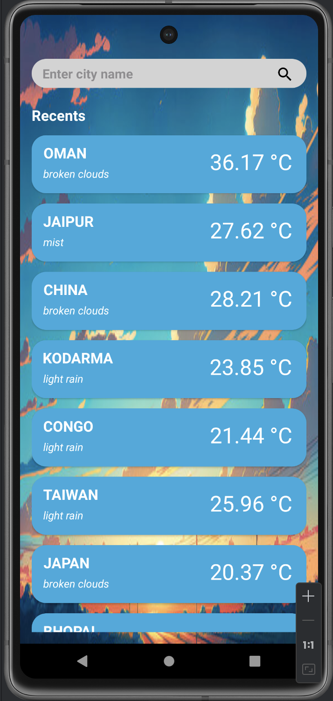
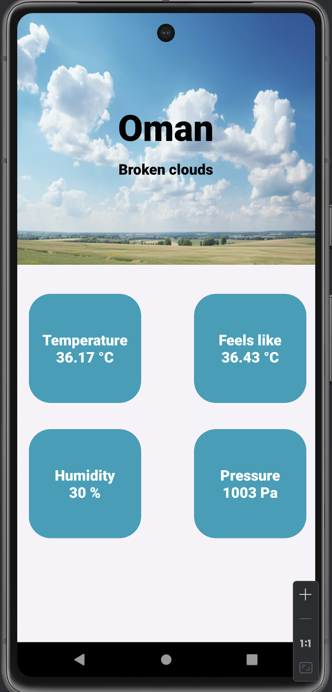
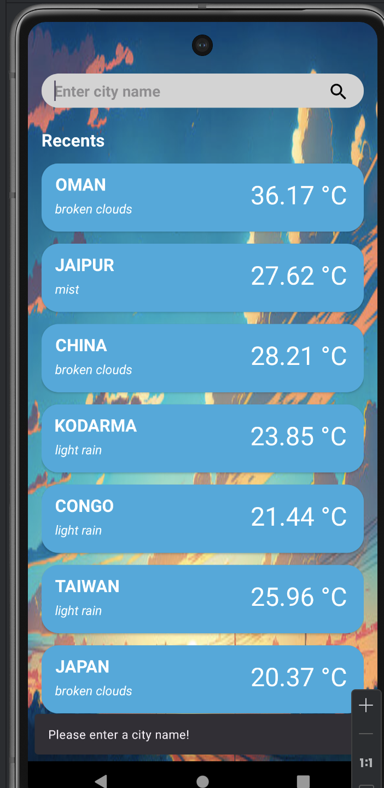
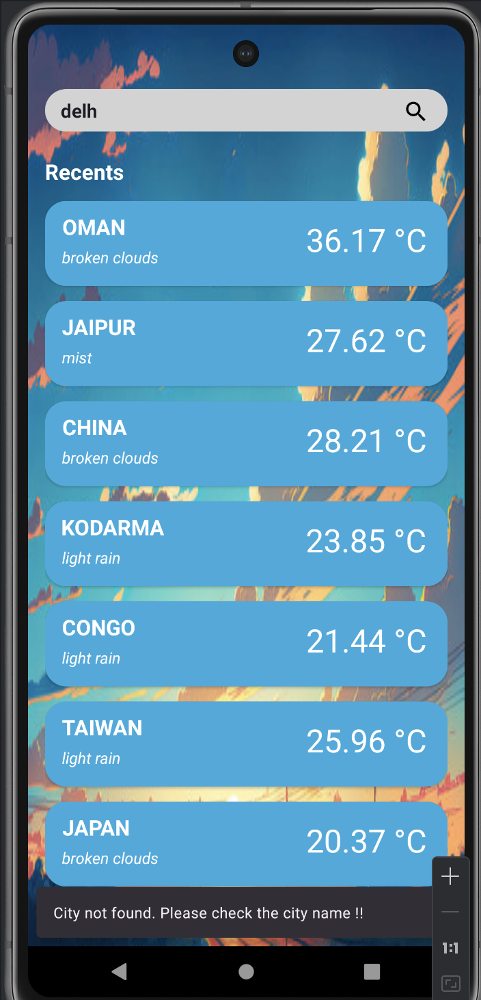
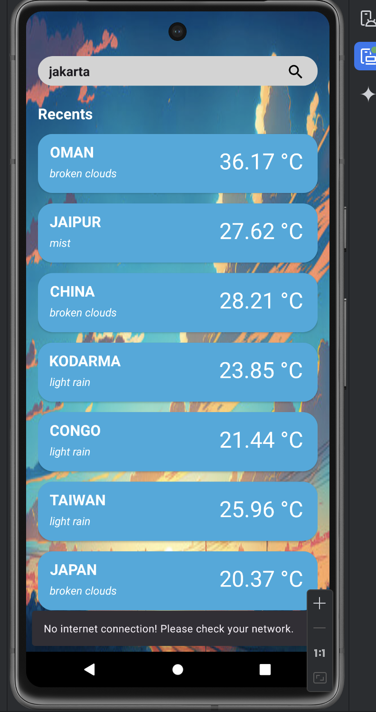

# **WeatherApp**

## **Overview**
WeatherApp is an Android application developed in Java that allows users to search for weather information of various cities. The app leverages **Room Database** for local data storage and caching, while **Retrofit** is used for making network requests to fetch real-time weather details. It also includes validations for handling common issues such as empty searches, incorrect city names, and lack of internet connection.

## **Key Features**
- **Recent Searches**: Displays the 10 most recent city searches directly on the MainActivity.
- **City Search with Caching**: Optimizes network calls by caching weather data for cities.
  - If the weather data for a searched city is **less than 4 hours old**, the app retrieves it from the local Room Database.
  - If the data is **older than 4 hours**, the app makes a new API request using Retrofit, and the fresh data is saved in the Room DB.
- **Validations**:
  - **Empty Search**: Prevents searching with an empty search bar and prompts the user to input a city name.
  - **Incorrect City Name**: Shows an appropriate error message if the user inputs an invalid or nonexistent city name.
  - **No Internet Connection**: Displays an error message if there is no internet connection and suggests checking network settings.

## **Technologies Used**
- **Java**
- **Room Database**: For local storage and caching of weather data and recent searches.
- **Retrofit**: For making network API requests to fetch weather information.
- **MVVM Architecture**: Ensures clean separation of UI and business logic.

## **Screenshots**

1. **MainActivity with Recent Searches**  
   

2. **WeatherDetailActivity with Weather Info**  
   

3. **Empty Search Validation**  
   

4. **Incorrect City Name Error**  
   

5. **No Internet Connection Error**  
   
